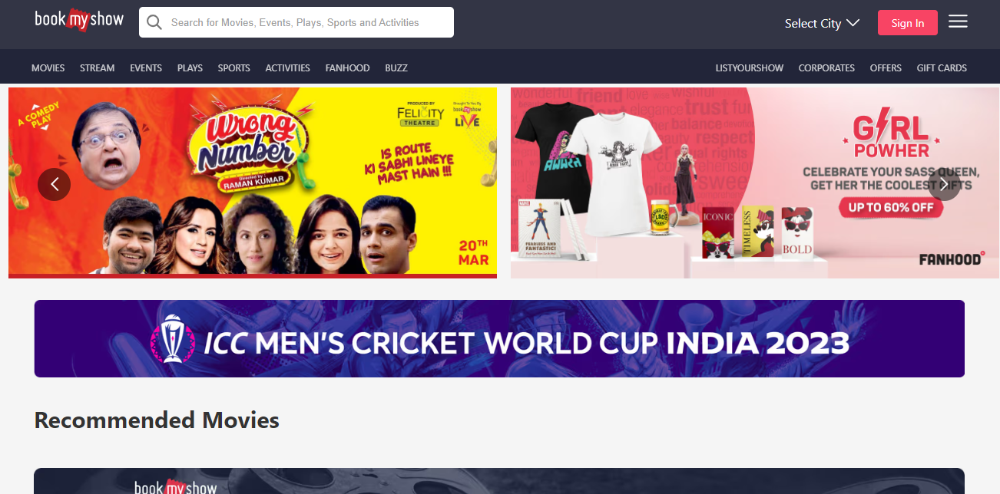
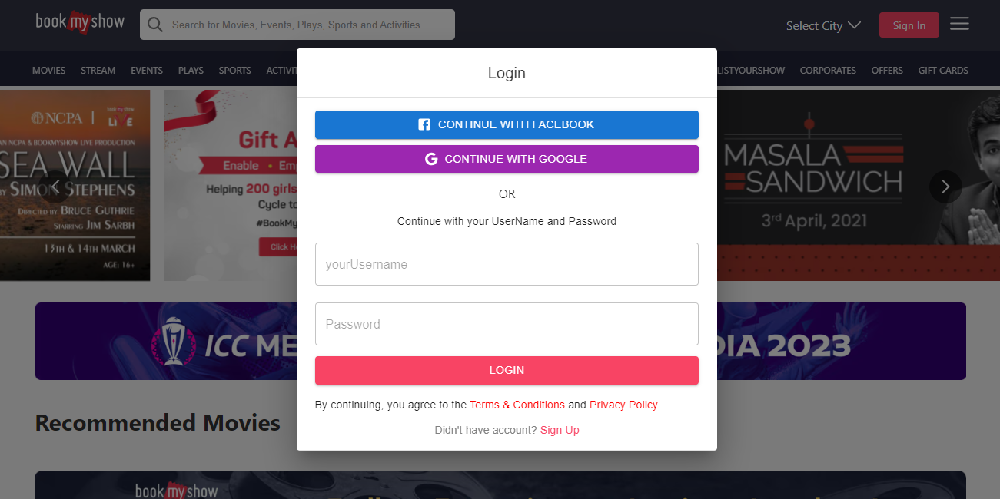
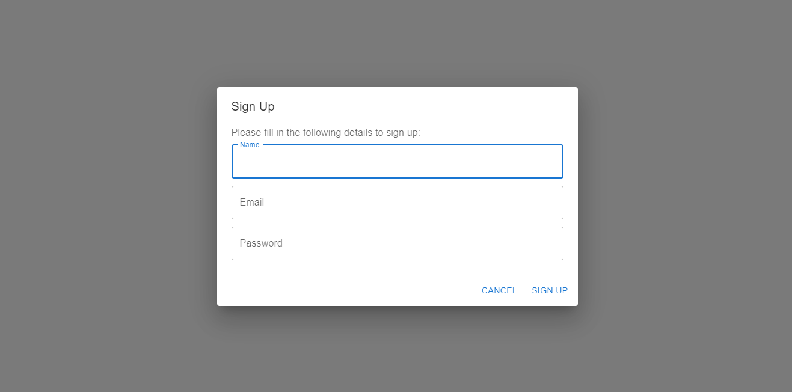
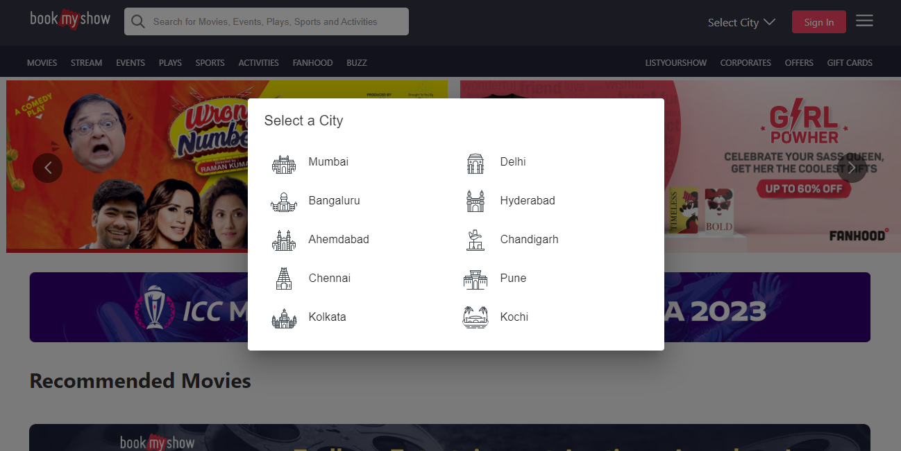

# BookMyShow

I have developed an innovative and engaging Book My Show app to assist users in purchasing and exploring movie tickets.
I have used java to create a robust and scalable backend services.
For the frontend, I have used ReactJS library to create a dynamic and interactive UI to provide seamless user experience.

<h3>Here are some scrrenshots to give you an idea of the app's layout and design</h3>

Homepage

Login Modal

SignUp Form

City Selection modal

